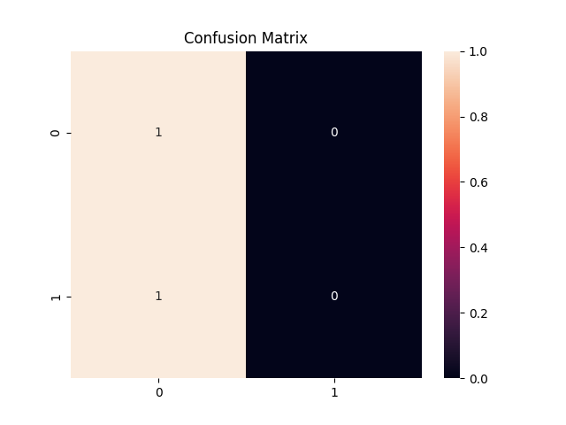
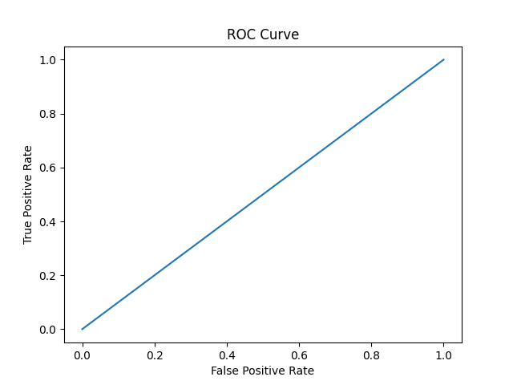

# 📊 Customer Churn Prediction - Future Interns (Task 2)

This project is part of **Future Interns - Machine Learning Internship (Task 2)**.  
The goal is to build a **Churn Prediction System** that identifies whether a customer will leave a service (Churn = Yes/No) using machine learning.

---

## 📁 Project Structure

---

## 🎯 Objective

Customer churn prediction helps businesses understand **which customers are likely to leave** and take preventive actions.

This project uses a **machine learning classification model (XGBoost)** to predict churn based on customer usage patterns and demographic information.

---

## 📂 Dataset Information

The dataset contains customer details such as:

- Gender  
- Senior Citizen  
- Partner / Dependents  
- Tenure  
- Internet Service  
- Contract Type  
- Payment Method  
- Monthly Charges & Total Charges  
- Churn (Target Variable)

A sample dataset (`churn_data.csv`) is used for demonstration.

---

## 🔧 Technologies Used

- **Python**
- **Pandas**
- **NumPy**
- **Scikit-Learn**
- **XGBoost**
- **Matplotlib**
- **Seaborn**
- **Google Colab**

---

## 🚀 Workflow

### **1. Load Dataset**
The dataset is imported using Pandas.

### **2. Preprocessing**
- Handling categorical variables  
- Converting Yes/No to 1/0  
- One-Hot Encoding  
- Cleaning the dataset  

### **3. Split Dataset**
Data is split into training and testing sets.

### **4. Train Model**
An **XGBoost Classifier** is trained to predict churn.

### **5. Evaluate Model**
Generated:

✔ Confusion Matrix  
✔ ROC Curve  
✔ Accuracy Score  
✔ Classification Report  

---

## 📈 Model Performance

### 🔹 Confusion Matrix

---

### 🔹 ROC Curve

---

## 💾 Saved Model

The trained model is saved as:

This can be used later for deployment or integration into applications.

---

## 📦 How to Run This Project

1. Open the notebook in Google Colab  
2. Upload `churn_data.csv`  
3. Run all cells step-by-step  
4. The notebook will generate:
   - `confusion_matrix.png`
   - `roc_auc.png`
   - `churn_model.pkl`

---

## 🏁 Conclusion

This Churn Prediction System:

- Analyzes customer behavior  
- Predicts probability of churn  
- Helps companies retain customers  
- Visualizes model performance  

This completes **Task 2** of the Future Interns ML Internship.

---

## 👨‍💻 Developer

**Uday Karthik**  
Future Interns – Machine Learning Intern
